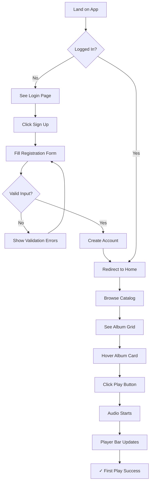
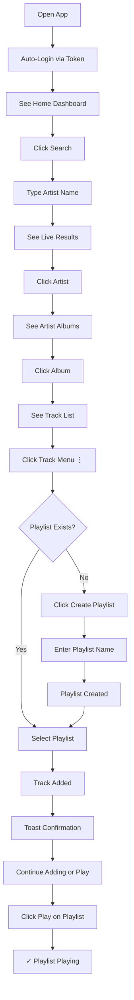
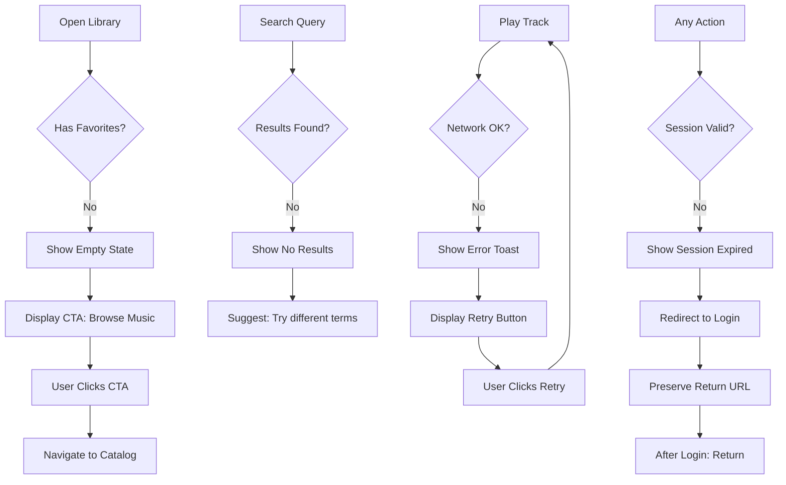

# UX Design Specification - spotifou

**Author:** ayaco
**Date:** 2026-01-27

---

## Executive Summary

### Project Vision

**spotifou** is a Spotify-inspired music streaming web application built as a full-stack learning project. The UX goal is to create a clean, minimal interface that lets users browse, play, and organize music effortlessly. The design should feel simple and personal - differentiating from cluttered music apps.

| Aspect | Details |
|--------|---------|
| **Product Type** | Music streaming web app (SPA) |
| **Platform** | Desktop-first, tablet-compatible |
| **Design Philosophy** | Clean, minimal, personal |
| **Core Experience** | Browse → Play → Organize |

### Target Users

**Primary Persona: Alex, the Music Explorer**

- Music enthusiast who loves discovering and organizing tracks
- Tech-savvy, values efficiency and clean interfaces
- Frustrated by cluttered, feature-bloated music apps
- Wants a simple, personal space for their music collection
- Uses desktop primarily, occasionally tablet

### Key Design Challenges

1. **Persistent Player Component** - Audio player must remain accessible while navigating between views (similar to Spotify's bottom bar)
2. **3-Level Information Architecture** - Catalog hierarchy (Artists → Albums → Tracks) must feel intuitive and easy to navigate
3. **Empty State Guidance** - First-time users see empty library/playlists; design must guide them toward meaningful actions
4. **Desktop-First Responsive** - Primary desktop experience with graceful tablet adaptation

### Design Opportunities

1. **Clean & Minimal Aesthetic** - Differentiate from cluttered competitors with focused, distraction-free interface
2. **One-Click Actions** - Quick add-to-playlist, instant favorite toggle for efficient music organization
3. **Smooth Animations** - Use Framer Motion for polished micro-interactions that delight users

## Core User Experience

### Defining Experience

The spotifou experience centers on **frictionless music playback**. Users should be able to go from landing on the app to hearing music in under 30 seconds. The interface stays out of the way, letting the music be the focus.

**Core Loop:** Browse → Play → Organize → Discover more

### Platform Strategy

| Platform | Support Level |
|----------|---------------|
| Desktop Web | Primary - Full feature set |
| Tablet Web | Secondary - Responsive adaptation |
| Mobile Web | Growth phase (PWA) |

**Key Platform Decisions:**
- SPA with client-side routing (React Router)
- Persistent audio player component (doesn't reload on navigation)
- Keyboard shortcuts for power users
- Standard web patterns (no custom gestures)

### Effortless Interactions

| Interaction | Target Effort |
|-------------|---------------|
| Play any track | 1 click |
| Pause/resume | 1 click (spacebar shortcut) |
| Add to favorites | 1 click (heart icon) |
| Add to playlist | 2 clicks (menu → select playlist) |
| Search | Type and see (no submit) |
| Navigate | Breadcrumb-style back navigation |

### Critical Success Moments

1. **First Play** - Audio starts playing, progress bar moves, user thinks "this works"
2. **First Playlist** - User creates and populates their first playlist
3. **Return Visit** - Still logged in, library intact, picks up seamlessly
4. **Empty Recovery** - Clear CTAs guide user from empty states to content

### Experience Principles

| Principle | Meaning |
|-----------|---------|
| **Play First** | Every design decision prioritizes ease of playback |
| **Zero Friction** | Minimize clicks, eliminate unnecessary confirmations |
| **Always Accessible** | Player controls visible from every view |
| **Clean Focus** | Show only what's needed for current task |

## Desired Emotional Response

### Primary Emotional Goals

| Goal | Description |
|------|-------------|
| **Calm Focus** | The interface disappears; music is the experience |
| **Effortless Control** | User feels empowered, not managed |
| **Personal Ownership** | "This is MY music collection" |
| **Quiet Delight** | Moments of polish that spark joy |

### Emotional Journey Mapping

| Touchpoint | Emotion | Design Support |
|------------|---------|----------------|
| Landing/Login | Welcomed | Clean entry, no barriers |
| Browsing Catalog | Curious discovery | Visual hierarchy, easy scanning |
| Playing Music | Satisfied calm | Persistent player, clear controls |
| Organizing | Accomplished | Quick actions, confirmation feedback |
| Empty States | Guided, not lost | Helpful prompts, clear CTAs |
| Errors | Understood | Friendly messages, recovery options |

### Micro-Emotions

**Target States:**
- Confidence in every interaction
- Trust that actions will work as expected
- Small moments of delight through polish

**Avoid:**
- Confusion from unclear navigation
- Frustration from slow or broken playback
- Anxiety from data loss or unexpected behavior

### Emotional Design Principles

| Principle | Implementation |
|-----------|----------------|
| **Reduce cognitive load** | Hide complexity, show only what's needed |
| **Immediate feedback** | Every action gets visual/audio response |
| **Forgiveness** | Undo options, confirmations for destructive actions |
| **Consistent rhythm** | Predictable animations, familiar patterns |
| **Personal touch** | User's name, their playlists prominently displayed |

## UX Pattern Analysis & Inspiration

### Inspiring Products Analysis

**Primary Inspiration: Spotify**

| Aspect | What They Do Well |
|--------|-------------------|
| Persistent Player | Bottom bar stays visible across all views |
| Navigation | Left sidebar for main sections, breadcrumb for catalog |
| Quick Actions | Right-click context menus, drag-and-drop |
| Search | Instant results as you type |
| Now Playing | Full-screen view option, queue visibility |

**Secondary Inspiration: Apple Music**

| Aspect | What They Do Well |
|--------|-------------------|
| Clean Aesthetic | Lots of white space, album art focus |
| Typography | Clear hierarchy, readable |
| Library Organization | Simple tabs for Artists/Albums/Songs |

**Tertiary Inspiration: Linear**

| Aspect | What They Do Well |
|--------|-------------------|
| Minimalism | Only shows what's needed |
| Keyboard Shortcuts | Power user efficiency |
| Animations | Subtle, purposeful transitions |

### Transferable UX Patterns

**Navigation Patterns:**

| Pattern | Source | Use in Spotifou |
|---------|--------|-----------------|
| Persistent bottom player | Spotify | Audio controls always visible |
| Left sidebar navigation | Spotify | Main sections (Home, Search, Library, Playlists) |
| Breadcrumb drilling | Spotify | Artists → Albums → Tracks |

**Interaction Patterns:**

| Pattern | Source | Use in Spotifou |
|---------|--------|-----------------|
| Click row to play | Spotify | Track lists playable with single click |
| Heart toggle | Spotify | Instant favorite/unfavorite |
| Context menu | Spotify | Right-click for more actions |
| Live search | All | Results appear as you type |

**Visual Patterns:**

| Pattern | Source | Use in Spotifou |
|---------|--------|-----------------|
| Album art prominence | Apple Music | Large artwork in player |
| Dark mode option | All | User preference |
| Subtle animations | Linear | Framer Motion transitions |

### Anti-Patterns to Avoid

| Anti-Pattern | Problem | Alternative |
|--------------|---------|-------------|
| Too many tabs | Cognitive overload | Max 5 main navigation items |
| Autoplay without consent | Annoying | User initiates playback |
| Hidden controls | Frustrating discovery | Clear affordances |
| Modal overload | Interrupts flow | Inline editing, toasts |
| Complex onboarding | Drop-off | Minimal signup, explore first |

### Design Inspiration Strategy

**Adopt Directly:**
- Persistent bottom player bar (Spotify)
- Left sidebar navigation (Spotify)
- Heart icon for favorites (universal)
- Search-as-you-type (universal)

**Adapt for Spotifou:**
- Simpler context menus (fewer options than Spotify)
- Cleaner aesthetic (more Apple Music, less Spotify busy-ness)
- Prominent empty states (learning project needs guidance)

**Avoid:**
- Premium upsell patterns (not applicable)
- Social features complexity (Growth phase)
- Algorithmic recommendations (Growth phase)

## Design System Foundation

### Design System Choice

**Primary:** Tailwind CSS (utility-first styling)
**Components:** Shadcn/ui (headless, copy-paste React components)
**Animations:** Framer Motion
**Icons:** Lucide React (Shadcn default)

### Rationale for Selection

| Reason | Benefit |
|--------|---------|
| **Learning-focused** | Tailwind teaches modern CSS patterns |
| **Clean aesthetic** | Utility classes enable minimal design easily |
| **Full control** | Shadcn/ui gives you the code, not hidden abstractions |
| **Modern stack** | Industry-standard tooling (Vite + Tailwind = fast) |
| **Animation-ready** | Framer Motion integrates cleanly |

### Implementation Approach

| Layer | Tool | Purpose |
|-------|------|---------|
| **Styling** | Tailwind CSS | Utility classes for all styling |
| **Components** | Shadcn/ui | Button, Input, Dialog, Toast, etc. |
| **Layout** | Tailwind Grid/Flex | Responsive layouts |
| **Animations** | Framer Motion | Micro-interactions, transitions |
| **Icons** | Lucide React | Consistent icon set |
| **Theming** | CSS Variables | Dark mode, color customization |

### Customization Strategy

**Design Tokens (CSS Variables):**
- Primary colors (music player accent)
- Background colors (dark mode ready)
- Typography scale
- Spacing scale
- Border radius

**Component Customizations:**
- Player bar component (custom)
- Track list item (custom)
- Album grid (custom layout)
- Sidebar navigation (Shadcn Sheet adapted)

## Defining Core Experience

### Core Experience Statement

**One-Sentence Definition:** Click anywhere to play music instantly.

The spotifou experience is defined by **immediacy** - from the moment a user sees a track, album, or playlist, playback is one click away. The interface exists to serve music, not to distract from it.

### User Mental Model

| Concept | User Understands |
|---------|------------------|
| **Everything is playable** | Any list of tracks can be clicked to start playing |
| **Player is always there** | Bottom bar shows what's playing, always accessible |
| **Library is personal** | Favorites and playlists are "mine" |
| **Navigation is simple** | Home, Search, Library - that's it |

### Core Experience Criteria

| Criteria | Target | Measurement |
|----------|--------|-------------|
| **Click-to-Sound** | < 500ms | Time from play click to audio output |
| **Visual Feedback** | Immediate | Play button animates on click |
| **Progress Visibility** | Always | Player shows current position |
| **Playback Control** | 1 click | Pause, skip available instantly |

### Pattern Analysis

**Established Patterns Used:**
- Persistent bottom player (Spotify standard)
- Left sidebar navigation (music app convention)
- Heart icon for favorites (universal)
- Track list with hover actions (Spotify pattern)

**Novel Patterns:** None required - using well-established music app conventions

### Experience Mechanics

**Primary Action: Play a Track**

| Step | User Action | System Response |
|------|-------------|-----------------|
| 1 | Hovers over track row | Row highlights, play icon appears |
| 2 | Clicks play icon or row | Audio loads and starts |
| 3 | Sees player update | Album art, title, artist show in player |
| 4 | Hears music | Audio plays through browser |

**Supporting Actions:**

| Action | Effort | Feedback |
|--------|--------|----------|
| Pause | 1 click (player) or spacebar | Icon changes, audio stops |
| Favorite | 1 click (heart) | Heart fills, toast confirms |
| Add to playlist | 2 clicks (menu → select) | Toast confirms addition |
| Search | Type and see | Results appear live |

## Visual Design Foundation

### Color System

**Theme: Midnight Blue (Dark)**

| Role | Color | Usage |
|------|-------|-------|
| **Background** | `#0F172A` (slate-900) | Main app background |
| **Surface** | `#1E293B` (slate-800) | Cards, sidebar, player bar |
| **Surface Elevated** | `#334155` (slate-700) | Hover states, dropdowns |
| **Primary Accent** | `#3B82F6` (blue-500) | Play button, active states, links |
| **Primary Hover** | `#2563EB` (blue-600) | Accent hover states |
| **Text Primary** | `#F8FAFC` (slate-50) | Headings, important text |
| **Text Secondary** | `#94A3B8` (slate-400) | Descriptions, metadata |
| **Text Muted** | `#64748B` (slate-500) | Timestamps, subtle info |
| **Success** | `#22C55E` (green-500) | Playing indicator, confirmations |
| **Error** | `#EF4444` (red-500) | Error states, destructive actions |

**Contrast Compliance:** All text combinations meet WCAG AA standards.

### Typography System

**Font Stack:** Inter (system font via Tailwind defaults)

| Element | Size | Weight | Line Height |
|---------|------|--------|-------------|
| **H1 (Page Title)** | 2rem (32px) | 700 | 1.2 |
| **H2 (Section)** | 1.5rem (24px) | 600 | 1.3 |
| **H3 (Card Title)** | 1.125rem (18px) | 600 | 1.4 |
| **Body** | 1rem (16px) | 400 | 1.5 |
| **Small** | 0.875rem (14px) | 400 | 1.5 |
| **Caption** | 0.75rem (12px) | 400 | 1.4 |

### Spacing & Layout Foundation

**Base Unit:** 8px

| Scale | Value | Usage |
|-------|-------|-------|
| **xs** | 4px | Icon gaps, tight spacing |
| **sm** | 8px | Inline elements, small gaps |
| **md** | 16px | Component padding, list gaps |
| **lg** | 24px | Section spacing, card padding |
| **xl** | 32px | Major section breaks |
| **2xl** | 48px | Page margins, hero spacing |

**Layout Structure:**
- Sidebar: 240px fixed width
- Player bar: 72px fixed height
- Content area: Fluid, max-width 1400px
- Grid: 12-column for album grids, flexible for lists

### Accessibility Considerations

- All color combinations maintain 4.5:1 contrast ratio minimum
- Focus states use visible blue ring (`ring-blue-500`)
- Interactive elements minimum 44x44px touch targets
- Reduced motion support via `prefers-reduced-motion`

## Design Direction Decision

### Design Directions Explored

Six distinct layout approaches were evaluated:
1. Classic Layout (Spotify-style sidebar + main + bottom player)
2. Compact Dense (icon sidebar, dense track list)
3. Card Focus (top nav, large hero, card grid)
4. Minimal Clean (maximum whitespace, Linear-inspired)
5. Full Player (player as main view, queue sidebar)
6. Split View (master-detail layout)

### Chosen Direction

**Direction 1: Classic Layout**

| Element | Implementation |
|---------|----------------|
| **Navigation** | 240px fixed left sidebar |
| **Content Area** | Fluid main content with gradient backgrounds |
| **Player** | 72px fixed bottom bar, always visible |
| **Album Display** | 5-column grid with hover play buttons |
| **Quick Access** | 3-column shortcut cards at top |

### Design Rationale

| Reason | Benefit |
|--------|---------|
| **Familiar pattern** | Users instantly understand navigation |
| **Proven UX** | Spotify has validated this layout with millions |
| **Learning value** | Teaches persistent layouts, React Router outlets |
| **Scalable** | Easy to add sections without redesign |
| **Responsive-ready** | Sidebar collapses cleanly for tablet |

### Implementation Approach

**Layout Structure:**
```
┌─────────────────────────────────────────┐
│  Sidebar (240px)  │  Main Content       │
│  - Logo           │  - Page header      │
│  - Nav items      │  - Content grid     │
│  - Playlists      │  - Scrollable       │
├───────────────────┴─────────────────────┤
│  Player Bar (72px fixed)                │
└─────────────────────────────────────────┘
```

**Key Components:**
- `AppLayout` - Root layout with sidebar + outlet + player
- `Sidebar` - Navigation and playlist list
- `PlayerBar` - Persistent audio controls
- `AlbumGrid` - Responsive album card grid
- `TrackList` - Table-style track listing

## User Journey Flows

### Journey 1: First Time User - Discovery to First Play

**Goal:** User goes from landing to hearing music in under 30 seconds



**Key Interactions:**

| Step | User Action | System Response | Feedback |
|------|-------------|-----------------|----------|
| Register | Submit form | Validate + create account | Success toast |
| Browse | Scroll catalog | Load album grid | Smooth animations |
| Play | Click play button | Start audio stream | Player bar animates |

### Journey 2: Returning User - Playlist Creation

**Goal:** Create and populate a playlist with favorite tracks



**Key Interactions:**

| Step | User Action | System Response | Feedback |
|------|-------------|-----------------|----------|
| Search | Type query | Live results appear | Debounced 300ms |
| Add to playlist | Select from menu | Add track to playlist | Toast "Added to X" |
| Create playlist | Enter name | Create + select | Instant creation |

### Journey 3: Edge Cases - Empty States & Errors

**Goal:** User understands what to do when things are empty or broken



**Empty State Messages:**

| State | Message | CTA |
|-------|---------|-----|
| Empty Library | "No favorites yet" | "Browse Music" |
| Empty Playlists | "Create your first playlist" | "New Playlist" |
| No Search Results | "No results for '{query}'" | "Try different terms" |
| Network Error | "Couldn't load. Check connection." | "Retry" |

### Journey Patterns

**Navigation Patterns:**
- Breadcrumb drilling: Home → Artist → Album → Track
- Persistent player: Always visible, never interrupts navigation
- Return URLs: Preserve context after auth redirects

**Feedback Patterns:**
- Instant visual: Button states change immediately
- Toast notifications: Confirm actions (2s auto-dismiss)
- Loading states: Skeleton screens for content, spinner for actions

**Error Recovery Patterns:**
- Retry buttons: Always offer retry for network failures
- Graceful degradation: Show cached data when possible
- Clear guidance: Tell users what went wrong and how to fix

### Flow Optimization Principles

| Principle | Implementation |
|-----------|----------------|
| **Minimize clicks** | Play any track in 1 click from anywhere |
| **Reduce waiting** | Optimistic UI updates, lazy loading |
| **Clear progress** | User always knows where they are |
| **Easy recovery** | Every error has a clear next step |

## Component Strategy

### Design System Components (Shadcn/ui)

**Foundation Layer:**
- `Button` - Primary, secondary, ghost variants
- `Input` - Search, form fields with validation
- `Dialog` - Modal dialogs for create/edit actions
- `DropdownMenu` - Context menus (right-click on tracks)
- `Toast` - Action confirmations, error messages
- `Slider` - Progress bar, volume control
- `ScrollArea` - Scrollable track lists, sidebar
- `Skeleton` - Loading placeholders

### Custom Components

#### PlayerBar

**Purpose:** Persistent audio playback controls at bottom of screen

**Anatomy:**
```
┌─────────────────────────────────────────────────────────┐
│ [Art] Title     │ ⏮ ▶ ⏭  ──●────── 1:23/3:45 │ 🔊 ═══ │
│       Artist    │                                       │
└─────────────────────────────────────────────────────────┘
```

**States:** Idle, Playing, Paused, Loading, Error
**Props:** `currentTrack`, `isPlaying`, `progress`, `volume`, `onPlay`, `onPause`, `onSeek`, `onVolumeChange`

#### TrackRow

**Purpose:** Single track in a list with hover actions

**Anatomy:**
```
┌─────────────────────────────────────────────────────┐
│ # │ [Art] Title          │ Album      │ ♡ │ 3:24 │ ⋮ │
│   │       Artist         │            │   │      │   │
└─────────────────────────────────────────────────────┘
```

**States:** Default, Hover (show play icon), Playing (show animation), Selected
**Props:** `track`, `index`, `isPlaying`, `isFavorite`, `onPlay`, `onFavorite`, `onMenuClick`

#### AlbumCard

**Purpose:** Album/playlist display in grid layout

**Anatomy:**
```
┌─────────────┐
│   [Image]   │
│         ▶   │  ← Play button on hover
├─────────────┤
│ Title       │
│ Artist      │
└─────────────┘
```

**States:** Default, Hover (lift + show play), Loading
**Props:** `album`, `onPlay`, `onClick`
**Size Variants:** `sm` (160px), `md` (200px), `lg` (240px)

#### Sidebar

**Purpose:** Main navigation and playlist list

**Sections:**
1. Logo + brand
2. Main nav (Home, Search, Library)
3. Playlist section header + create button
4. Scrollable playlist list

**Props:** `playlists`, `currentPath`, `onCreatePlaylist`

#### EmptyState

**Purpose:** Guide users when lists are empty

**Anatomy:**
```
┌─────────────────────┐
│        [Icon]       │
│                     │
│    Primary Text     │
│   Secondary Text    │
│                     │
│   [ CTA Button ]    │
└─────────────────────┘
```

**Props:** `icon`, `title`, `description`, `ctaLabel`, `onCtaClick`

### Component Implementation Strategy

| Approach | Details |
|----------|---------|
| **Composition** | Build custom components using Shadcn primitives |
| **Styling** | Tailwind utilities + CSS variables for theming |
| **Animation** | Framer Motion for hover, transitions |
| **State** | Props for controlled components, internal for UI state |
| **Accessibility** | ARIA labels, keyboard nav, focus management |

### Implementation Roadmap

**Phase 1 - Core (MVP):**
- `PlayerBar` - Critical for playback experience
- `TrackRow` - Core catalog interaction
- `AlbumCard` - Browse experience
- `Sidebar` - Navigation foundation

**Phase 2 - Enhancement:**
- `EmptyState` - Better first-time experience
- `SearchResults` - Unified search display
- `PlaylistHeader` - Playlist detail view

**Phase 3 - Polish:**
- Skeleton variants for all content types
- Advanced hover animations
- Keyboard shortcut indicators

## UX Consistency Patterns

### Button Hierarchy

| Level | Style | Usage | Example |
|-------|-------|-------|---------|
| **Primary** | Blue filled (`bg-blue-500`) | Main action per view | "Play", "Save", "Create Playlist" |
| **Secondary** | Outline (`border-slate-600`) | Supporting actions | "Cancel", "Edit" |
| **Ghost** | Transparent hover | Repeated/inline actions | Heart icon, menu trigger |
| **Destructive** | Red filled (`bg-red-500`) | Irreversible actions | "Delete Playlist" |

**Button States:**
- Default → Hover (slight brightness) → Active (scale 0.98) → Disabled (opacity 50%)
- Loading: Show spinner, disable interaction

**Play Button Special Case:**
- Circular shape (rounded-full)
- Always primary blue
- White play icon
- Hover: scale 1.05 + shadow

### Feedback Patterns

**Toast Notifications:**

| Type | Icon | Color | Duration | Use Case |
|------|------|-------|----------|----------|
| Success | ✓ | Green | 2s | "Added to playlist" |
| Error | ✗ | Red | 4s | "Failed to save" |
| Info | ℹ | Blue | 3s | "Now playing" |

**Toast Behavior:**
- Position: Bottom-right
- Stack: Max 3 visible
- Dismiss: Auto + click X
- Animation: Slide in from right (Framer Motion)

**Loading States:**

| Context | Pattern |
|---------|---------|
| Page load | Skeleton screens matching layout |
| Action | Button spinner (replace icon) |
| Data fetch | Inline spinner for lists |
| Audio | Progress bar animation |

**Error States:**

| Error | Display | Recovery |
|-------|---------|----------|
| Network | Toast + inline message | Retry button |
| Validation | Field border red + message below | Fix and resubmit |
| 404 | Full page empty state | Link to home |
| Auth | Redirect to login | Preserve return URL |

### Form Patterns

**Input Fields:**
- Label above input (not placeholder-only)
- Helper text below when needed
- Error message replaces helper on invalid
- Focus: Blue ring (`ring-blue-500`)

**Validation:**
- Real-time for format (email, password strength)
- On-submit for required fields
- Clear error on user correction

**Form Layout:**
```
┌─────────────────┐
│ Label           │
│ ┌─────────────┐ │
│ │ Input       │ │
│ └─────────────┘ │
│ Helper / Error  │
└─────────────────┘
```

**Auth Forms:**
- Email + Password (login)
- Email + Password + Confirm (register)
- "Show password" toggle
- Submit button full width

### Navigation Patterns

**Sidebar Navigation:**
- Active item: Blue text + slate background
- Hover: Slate background
- Icons: 20px, left of label
- Spacing: 8px between items

**Breadcrumb Drilling:**
```
Home → Artists → [Artist Name] → [Album Name]
       ↑ clickable links         ↑ current (not linked)
```

**Back Navigation:**
- Browser back works (React Router)
- No explicit back button needed
- Preserve scroll position on return

**URL Structure:**

| Route | URL |
|-------|-----|
| Home | `/` |
| Search | `/search?q=query` |
| Artist | `/artist/:id` |
| Album | `/album/:id` |
| Playlist | `/playlist/:id` |
| Library | `/library` |

### Interaction Patterns

**Hover Actions:**
- Track row: Show play icon over track number
- Album card: Show play button + lift card
- Buttons: Brightness increase

**Click Feedback:**
- Immediate visual state change
- Optimistic UI for favorites/playlist adds
- Revert on error with toast

**Keyboard Shortcuts (Growth):**

| Key | Action |
|-----|--------|
| Space | Play/Pause |
| → | Skip 10s forward |
| ← | Skip 10s back |
| M | Mute toggle |
| / | Focus search |

### Confirmation Patterns

**Require Confirmation:**
- Delete playlist
- Remove track from playlist (optional)
- Log out

**No Confirmation Needed:**
- Add to favorites (easy undo via toggle)
- Add to playlist (toast with undo)
- Play actions

**Confirmation Dialog:**
```
┌───────────────────────────┐
│ Delete "Chill Vibes"?     │
│                           │
│ This cannot be undone.    │
│                           │
│    [Cancel]  [Delete]     │
└───────────────────────────┘
```

## Responsive Design & Accessibility

### Responsive Strategy

**Platform Priority:**

| Platform | Priority | Approach |
|----------|----------|----------|
| **Desktop** | Primary | Full feature set, optimized layout |
| **Tablet** | Secondary | Touch-optimized, simplified layout |
| **Mobile** | Growth | PWA, bottom nav (post-MVP) |

**Desktop (Primary):**
- Full sidebar navigation (240px)
- 5-column album grid
- Persistent bottom player (72px)
- Keyboard shortcuts supported
- Hover states for discovery

**Tablet Adaptation:**
- Collapsible sidebar (icon-only or hidden)
- 3-column album grid
- Larger touch targets (min 48px)
- Swipe gestures for player controls

### Breakpoint Strategy

**Tailwind Breakpoints (default):**

| Breakpoint | Size | Layout Changes |
|------------|------|----------------|
| `sm` | 640px | - |
| `md` | 768px | Tablet: sidebar collapses |
| `lg` | 1024px | Desktop: full sidebar |
| `xl` | 1280px | Wider content area |
| `2xl` | 1536px | Max-width container |

**Key Responsive Behaviors:**

```
Desktop (≥1024px):
┌──────────┬─────────────────────────┐
│ Sidebar  │   Main Content          │
│ (240px)  │   (5-col grid)          │
├──────────┴─────────────────────────┤
│        Player Bar                  │
└────────────────────────────────────┘

Tablet (768px - 1023px):
┌────┬───────────────────────────────┐
│ ≡  │   Main Content                │
│    │   (3-col grid)                │
├────┴───────────────────────────────┤
│        Player Bar                  │
└────────────────────────────────────┘
```

### Accessibility Strategy

**MVP Scope (Basic - Level A):**
- Semantic HTML structure
- Alt text for images
- Form labels and error messages
- Sufficient color contrast (4.5:1)
- Focus visible on interactive elements

**Growth Phase (WCAG AA):**
- Full keyboard navigation
- Screen reader optimization (ARIA)
- Skip links
- Focus management in modals
- Reduced motion support

### Accessibility Checklist (MVP)

| Requirement | Implementation |
|-------------|----------------|
| **Color Contrast** | All text meets 4.5:1 ratio (verified in Visual Foundation) |
| **Focus States** | Blue ring on all interactive elements |
| **Form Labels** | All inputs have visible labels |
| **Alt Text** | Album art has `alt={albumName}` |
| **Semantic HTML** | `<nav>`, `<main>`, `<button>`, `<header>` |
| **Touch Targets** | Minimum 44x44px for buttons |

### Testing Strategy

**Responsive Testing:**
- Chrome DevTools device emulation
- Real device testing (tablet if available)
- Cross-browser: Chrome, Firefox, Safari, Edge

**Accessibility Testing (Growth):**
- axe DevTools browser extension
- Lighthouse accessibility audit
- Keyboard-only navigation test
- VoiceOver (macOS) basic testing

### Implementation Guidelines

**Responsive Development:**
```css
/* Mobile-first approach */
.album-grid {
  @apply grid grid-cols-2 gap-4;     /* Default: 2 cols */
  @apply md:grid-cols-3;              /* Tablet: 3 cols */
  @apply lg:grid-cols-4;              /* Small desktop: 4 cols */
  @apply xl:grid-cols-5;              /* Large desktop: 5 cols */
}
```

**Accessibility Development:**
```jsx
// Semantic button with accessible name
<button
  aria-label="Play Midnight Dreams"
  onClick={handlePlay}
>
  <PlayIcon />
</button>

// Form with proper labeling
<label htmlFor="email">Email</label>
<input id="email" type="email" />
```

**Focus Management:**
- Trap focus in modals
- Return focus after modal closes
- Skip to main content link

